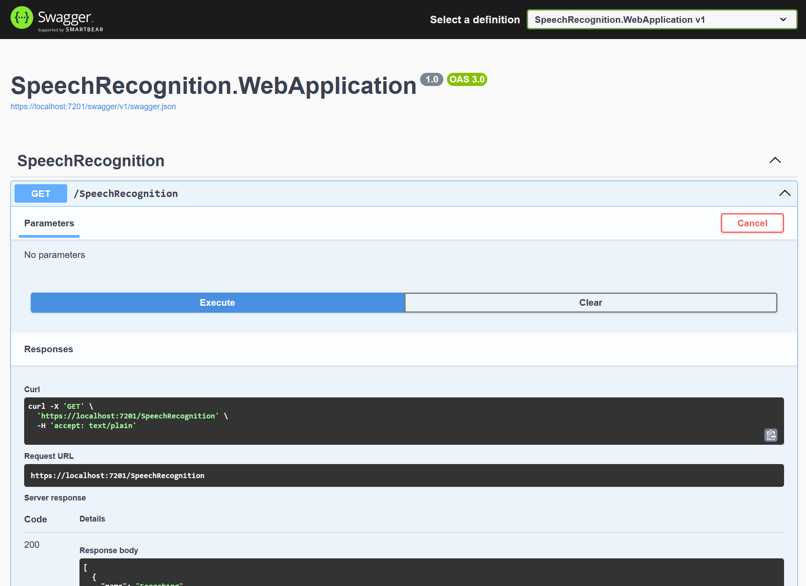

# Speech Recognition
A lightweight speech recognition web tool written in C#.

## Features
- Select different input commands to test recognition.
- Includes a REST API for external application queries.
- Includes bad commands to demonstrate functionality.
- Trains the system with a recognised command list.

## Screenshots 

## Source Code
View the project [Source Code](https://github.com/hayes0278/Speech-Recognition).

## How It Works
- Trains the system with a recognised command list.
- Reads and parses the input command from the user.
- Display to the user when a match was/not found.

## Development Links
- [Home Page](https://localhost:7201/) (Local)
- [Swagger](https://localhost:7201/swagger) (Local)

## Limitations
- Does not contain required security code for a production deployment.
- This is a bolerplate solution, very few extras are included.

## Proposed Features
- Should be able to accept voice input stream from the users' micophone.
- Enable the user to enter their own custom commands.